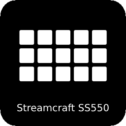

# OpenDeck Ajazz AKP153 / Mirabox HSV293 Plugin

An unofficial plugin for Mirabox HSV293-family devices

## Supported devices

- Mirabox HSV293S (5548:6670)
- Ajazz AKP153 (5548:6674)
- Ajazz AKP153E (0300:1010)
- Ajazz AKP153R (0300:1020)

## Installation

1. Download an archive from [releases](https://github.com/4ndv/opendeck-akp153/releases)
2. In OpenDeck: Plugins -> Install from file
3. Download [udev rules](./40-opendeck-akp153.rules) and install them by copying into `/etc/udev/rules.d/` and running `sudo udevadm control --reload-rules`
4. Unplug and plug again the device, restart OpenDeck

## Opendeck version notice

For OpenDeck versions < 2.5.0 this plugin requires a custom build of OpenDeck with ajazz/mirabox support disabled:

<details>
  <summary>What to patch</summary>

  ```diff
  diff --git a/src-tauri/src/elgato.rs b/src-tauri/src/elgato.rs
  index e11e02e..0c580cb 100644
  --- a/src-tauri/src/elgato.rs
  +++ b/src-tauri/src/elgato.rs
  @@ -119,7 +119,7 @@ pub async fn initialise_devices() {
          // Iterate through detected Elgato devices and attempt to register them.
          match elgato_streamdeck::new_hidapi() {
                  Ok(hid) => {
  -                       for (kind, serial) in elgato_streamdeck::asynchronous::list_devices_async(&hid, false) {
  +                       for (kind, serial) in elgato_streamdeck::asynchronous::list_devices_async(&hid, true) {
                                  match elgato_streamdeck::AsyncStreamDeck::connect(&hid, kind, &serial) {
                                          Ok(device) => {
                                                  tokio::spawn(init(device, serial));
  ```
</details>

## Acknowledgments

This plugin is heavily based on work by contributors of [elgato-streamdeck](https://github.com/streamduck-org/elgato-streamdeck) crate
